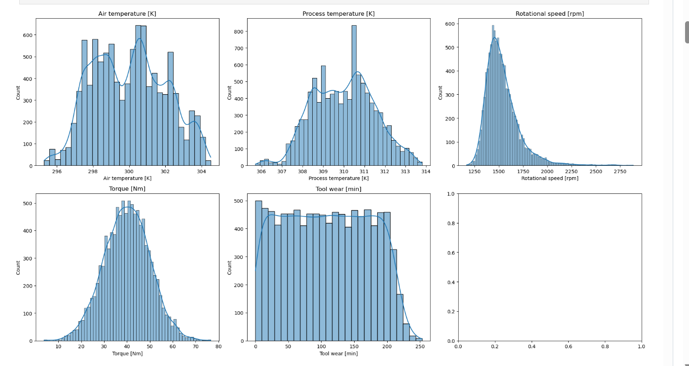
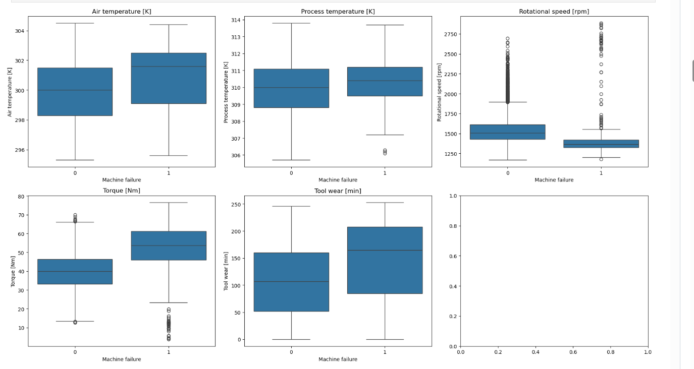
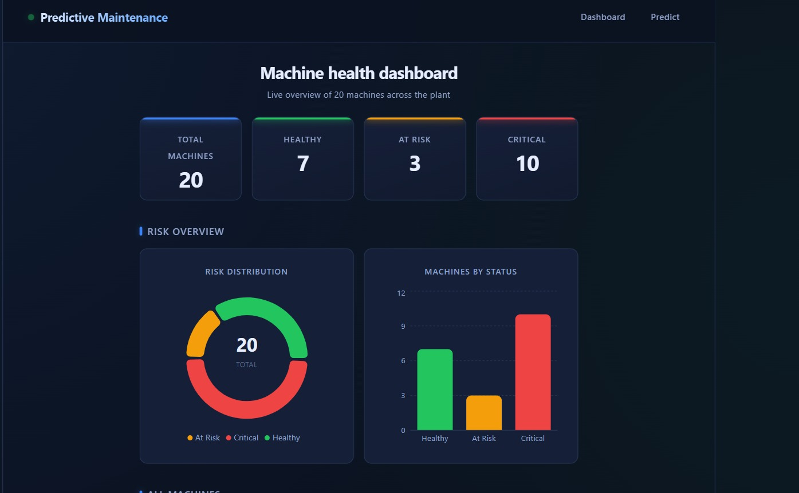
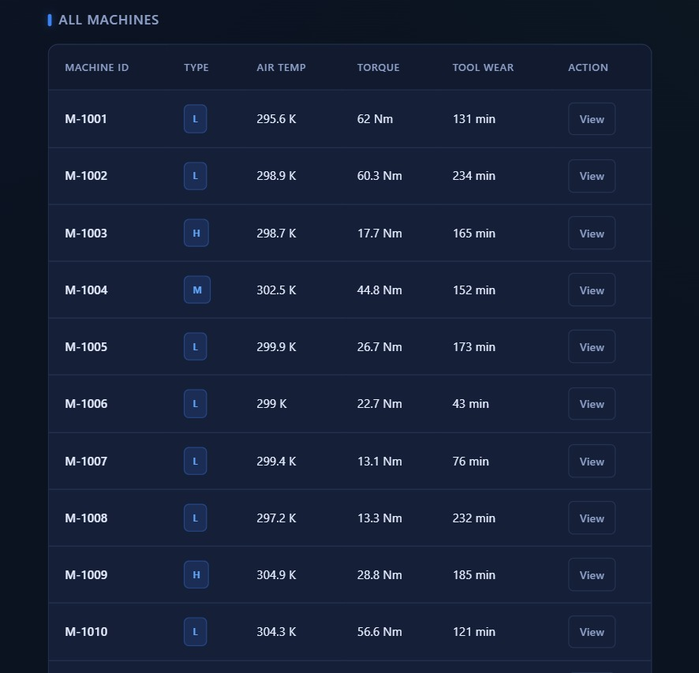
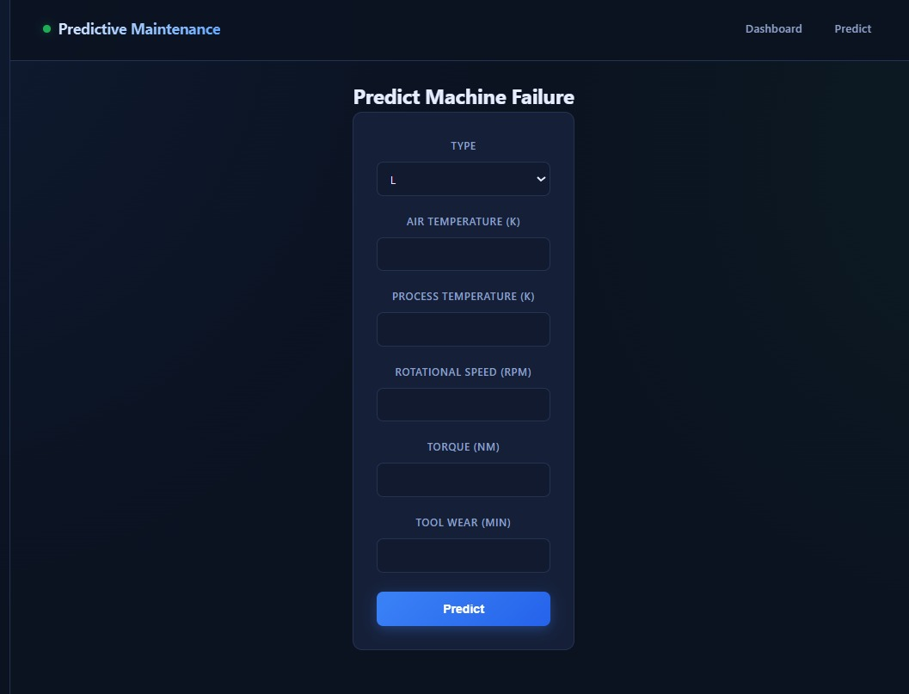

<div align="center">


[](https://git.io/typing-svg)


**An end-to-end machine learning system that predicts industrial machine failures before they happen — combining a tuned XGBoost model, a FastAPI backend, and a real-time React dashboard.**

[Overview](#-overview) • [Demo](#-live-demo-flow) • [Architecture](#-architecture) • [Model Performance](#-model-performance) • [Screenshots](#-screenshots) • [Setup](#-getting-started) • [API](#-api-reference)

</div>

---

## 📋 Overview

Factories run thousands of machines that degrade silently — a worn tool, a rising torque, a drifting temperature — until one day they fail, halting production. This project builds a **predictive maintenance system** that watches sensor readings (temperature, torque, rotational speed, tool wear) and predicts the probability of failure **before it happens**, giving maintenance teams time to act.

This is not just a Jupyter notebook — it's a **complete, production-shaped system**:

| Layer | What it does |
|---|---|
| 🧠 **ML Pipeline** | Cleans data, engineers physics-based features, trains & tunes XGBoost |
| ⚙️ **FastAPI Backend** | Serves real-time predictions, machine data, and analytics via REST API |
| 🎨 **React Dashboard** | Visualizes machine health, risk distribution, and lets users run live predictions |

---

## 🎬 Live Demo Flow

```
   👤 User opens Dashboard
          │
          ▼
   📊 Sees KPI cards (Total / Healthy / At Risk / Critical)
          │
          ▼
   📈 Views Risk Distribution charts (Donut + Bar)
          │
          ▼
   📋 Scrolls machine table → clicks "View" on any machine
          │
          ▼
   🔍 Machine Details page → live risk prediction shown
          │
          ▼
   🧪 Or goes to "Predict" page → enters custom sensor values
          │
          ▼
   ⚡ Gets instant prediction: Failure / No Failure + Risk Level
          │
          ▼
   ✅ New prediction auto-added to Dashboard machine list
```

---

## 🏗️ Architecture

```
┌──────────────────────────────────────────────────────────┐
│                        REACT FRONTEND                      │
│  ┌────────────┐  ┌──────────────┐  ┌──────────────────┐  │
│  │  Dashboard │  │   Predict    │  │  Machine Details  │  │
│  │  KPI+Charts│  │     Form     │  │   + Live Risk      │  │
│  └─────┬──────┘  └──────┬───────┘  └─────────┬─────────┘  │
└────────┼────────────────┼────────────────────┼─────────────┘
         │                │                    │
         └────────────────┼────────────────────┘
                           │  REST API (axios)
                           ▼
┌──────────────────────────────────────────────────────────┐
│                      FASTAPI BACKEND                       │
│  ┌────────────┐  ┌──────────────┐  ┌──────────────────┐  │
│  │  /predict  │  │  /machines   │  │    /analytics      │  │
│  └─────┬──────┘  └──────┬───────┘  └─────────┬─────────┘  │
│        └────────────────┴────────────────────┘             │
│                    utils/pipeline.py                        │
│           (shared feature engineering + scaling)            │
└───────────────────────────┬──────────────────────────────┘
                             │
                             ▼
┌──────────────────────────────────────────────────────────┐
│                      ML PIPELINE                            │
│   pm_xgb_model.pkl  │  pm_scaler.pkl  │  pm_threshold.pkl  │
│           Trained & tuned on AI4I 2020 dataset               │
└──────────────────────────────────────────────────────────┘
```

---

## 🔬 Machine Learning Pipeline

```
Raw CSV (10,000 rows)
        │
        ▼
   EDA & Cleaning ──────► drop IDs + leakage columns (TWF, HDF, PWF, OSF, RNF)
        │
        ▼
   Feature Engineering ─► Temp_diff, Power, Torque_per_wear, One-Hot(Type)
        │
        ▼
   Train / Val / Test Split (70 / 15 / 15, stratified)
        │
        ▼
   Standard Scaling (fit on train only)
        │
        ▼
   Model Comparison ────► Logistic Regression → Random Forest → XGBoost
        │
        ▼
   Hyperparameter Tuning (RandomizedSearchCV, 5-fold CV)
        │
        ▼
   Threshold Optimization (F1-maximizing cutoff = 0.70)
        │
        ▼
   Final Evaluation on Untouched Test Set
        │
        ▼
   Model + Scaler + Threshold Saved (joblib)
```

### Dataset

This project uses the **[AI4I 2020 Predictive Maintenance Dataset](https://archive.ics.uci.edu/ml/datasets/AI4I+2020+Predictive+Maintenance+Dataset)** (Matzka, 2020) — 10,000 synthetic but physics-grounded industrial sensor readings with a ~3.4% failure rate.

> ⚠️ **Note:** This dataset is synthetic, designed to mimic real factory sensor behavior. This project demonstrates the *engineering pipeline* end-to-end rather than claiming production deployment on live factory data.

### 📊 Exploratory Data Analysis

<div align="center">

| Feature Distributions | Failure vs Feature Boxplots |
|:---:|:---:|
|  |  |

**Correlation Heatmap**


</div>

Key takeaway: **Torque** and **Tool Wear** show the clearest separation between failed and healthy machines, and **Rotational Speed** is strongly inversely correlated with Torque (-0.88) — both align with real-world mechanical stress physics.

---

## 📊 Model Performance

Final model: **Tuned XGBoost** @ optimized threshold (0.70), evaluated on a held-out test set the model never saw during training or tuning.

| Model | Precision | Recall | F1-Score | ROC-AUC |
|---|:---:|:---:|:---:|:---:|
| Logistic Regression | 0.17 | 0.73 | 0.28 | 0.907 |
| Random Forest | 0.90 | 0.69 | 0.78 | 0.987 |
| XGBoost (default) | 0.79 | 0.82 | 0.81 | 0.989 |
| **XGBoost (tuned + threshold-optimized)** | **0.84** | **0.82** | **0.83** | **0.984** |

```
Failure Class Metrics (Test Set)
────────────────────────────────────────
Precision  ████████████████░░░░  84%
Recall     ████████████████░░░░  82%
F1-Score   ████████████████░░░░  83%
ROC-AUC    ███████████████████░  98.4%
```

**Confusion Matrix (Test Set):**

| | Predicted: No Failure | Predicted: Failure |
|---|:---:|:---:|
| **Actual: No Failure** | 1441 ✅ | 8 ❌ |
| **Actual: Failure** | 9 ❌ | 42 ✅ |

### Why these features matter (SHAP-driven insight)

| Feature | Impact on Failure Risk |
|---|---|
| 🔧 Torque | ⬆️ Strongest positive driver |
| ⏱️ Tool Wear | ⬆️ Strong positive driver |
| 🌡️ Temp Difference | ⬆️ Drives Heat Dissipation Failures |
| ⚡ Power | ⬆️ Drives Power Failures |
| 🔄 Rotational Speed | ⬇️ Higher speed → lower risk (inverse to torque) |

---

## 🖥️ Tech Stack

<div align="center">

| Category | Technology |
|---|---|
| **ML / Data** | Python, Pandas, NumPy, scikit-learn, XGBoost, SHAP |
| **Backend** | FastAPI, Pydantic, Uvicorn, Joblib |
| **Frontend** | React (Vite), React Router, Axios, Recharts |
| **Styling** | Custom CSS (dark industrial theme, no framework) |
| **Tooling** | Jupyter Notebook, Git, VS Code |

</div>

---

## 📁 Project Structure

```
predictive-maintenance-platform/
│
├── ml/
│   ├── notebooks/
│   │   └── Predictive_Maintenance_System.ipynb   # full EDA → training pipeline
│   ├── data/
│   │   ├── raw/                                   # original AI4I 2020 CSV
│   │   └── processed/                             # train/val/test splits
│   └── models/
│       ├── pm_xgb_model.pkl
│       ├── pm_scaler.pkl
│       ├── pm_threshold.pkl
│       └── pm_feature_columns.pkl
│
├── backend/
│   ├── app/
│   │   ├── main.py                # FastAPI app entrypoint
│   │   ├── schemas.py             # Pydantic request/response models
│   │   ├── models/                # copied .pkl artifacts
│   │   ├── routes/
│   │   │   ├── predict.py         # POST /predict
│   │   │   ├── machines.py        # GET /machines, /machines/{id}
│   │   │   └── analytics.py       # GET /analytics
│   │   └── utils/
│   │       └── pipeline.py        # shared feature engineering logic
│   ├── requirements.txt
│   └── venv/
│
├── frontend/
│   ├── src/
│   │   ├── components/
│   │   │   ├── dashboard/         # KPICard, RiskChart
│   │   │   ├── machines/          # MachineTable, MachineCard
│   │   │   └── common/            # Navbar, Loader
│   │   ├── pages/
│   │   │   ├── Dashboard.jsx
│   │   │   ├── Predict.jsx
│   │   │   └── MachineDetails.jsx
│   │   ├── services/
│   │   │   └── api.js             # Axios API client
│   │   ├── App.jsx
│   │   └── main.jsx
│   └── package.json
│
├── docs/
│   ├── eda.png
│   ├── eda2.png
│   ├── corelation heatmap.png
│   ├── ui1.jpeg
│   ├── ui2.jpeg
│   └── ui3.jpeg
│
└── README.md
```

---

## 🚀 Getting Started

### Prerequisites

- Python 3.11+
- Node.js 18+
- npm

### 1️⃣ Clone the repository

```bash
git clone https://github.com/<your-username>/predictive-maintenance-platform.git
cd predictive-maintenance-platform
```

### 2️⃣ Backend Setup

```bash
cd backend
python -m venv venv

# Activate venv
venv\Scripts\Activate.ps1        # Windows PowerShell
source venv/Scripts/activate     # Git Bash

pip install -r requirements.txt

uvicorn app.main:app --reload
```

Backend runs at → `http://127.0.0.1:8000`
Interactive API docs → `http://127.0.0.1:8000/docs`

### 3️⃣ Frontend Setup

Open a **new terminal**:

```bash
cd frontend
npm install
npm run dev
```

Frontend runs at → `http://localhost:5173`

### 4️⃣ (Optional) Retrain the model

```bash
cd ml/notebooks
jupyter notebook Predictive_Maintenance_System.ipynb
```

Run all cells top-to-bottom to reproduce the full EDA → training → SHAP pipeline.

---

## 📡 API Reference

Base URL: `http://127.0.0.1:8000`

| Method | Endpoint | Description |
|---|---|---|
| `GET` | `/` | Health/welcome message |
| `GET` | `/health` | Confirms API + model loaded |
| `POST` | `/predict` | Predict failure for a single machine |
| `GET` | `/machines` | List all machines (dummy + user-generated) |
| `GET` | `/machines/{machine_id}` | Get a single machine's details |
| `GET` | `/analytics` | Aggregated risk counts across all machines |

### Example — `POST /predict`

**Request:**
```json
{
  "Type": "L",
  "Air temperature": 302.0,
  "Process temperature": 311.5,
  "Rotational speed": 1350,
  "Torque": 65.0,
  "Tool wear": 220
}
```

**Response:**
```json
{
  "failure_probability": 1.0,
  "prediction": "Failure",
  "risk_level": "HIGH"
}
```

---

## 🎨 Screenshots

<div align="center">

### Dashboard — KPIs & Risk Distribution


*Live KPI cards, a donut chart for risk share, and a bar chart comparing machine counts by status.*

### All Machines Table


*Every machine — dummy-generated or user-predicted — listed with live sensor readings and a one-click "View" for full details.*

### Predict — Real-Time Risk Prediction


*Enter sensor readings manually and get an instant failure probability, prediction, and color-coded risk level.*

</div>

---

## 🧩 Key Engineering Decisions

- **No data leakage**: `TWF`, `HDF`, `PWF`, `OSF`, `RNF` columns dropped — they're sub-components of the target, not real-world predictors.
- **Physics-informed features**: `Power = Torque × ω` and `Temp_diff` mirror the actual formulas used to generate failure labels in the dataset.
- **Threshold tuning over default 0.5**: maximized F1 on the validation set to balance false alarms vs. missed failures — critical in a domain where both have real costs.
- **Shared prediction pipeline**: `utils/pipeline.py` avoids duplicating feature-engineering logic between `/predict` and `/analytics`.
- **In-memory machine store**: new predictions are appended live to the machine list for demo purposes; a production version would persist to a database (e.g., PostgreSQL).

---

## 🔮 Future Improvements

- [ ] Persist machines to a real database instead of in-memory list
- [ ] Add SHAP-based "why this prediction" explanations to the API response
- [ ] Batch prediction endpoint (`/predict/batch`) for CSV uploads
- [ ] Docker Compose for one-command deployment
- [ ] Authentication for multi-user access
- [ ] What-if simulator (slide sensor values, watch risk update live)

---

## 👤 Contributor

<div align="center">


**Muzammil Ahmed**
*AI & Computer Science (Specialization in AI) Student*

[](https://github.com/muzammilahmed321)
[](#)

</div>

---

## 📜 License

This project is licensed under the MIT License — feel free to use, modify, and learn from it.

---

## 🙏 Acknowledgements

- Dataset: [AI4I 2020 Predictive Maintenance Dataset](https://archive.ics.uci.edu/ml/datasets/AI4I+2020+Predictive+Maintenance+Dataset) — S. Matzka, 2020
- Built as an end-to-end portfolio project demonstrating ML engineering, API design, and full-stack integration.

<div align="center">

**⭐ If this project helped you learn something, consider giving it a star!**


</div>
